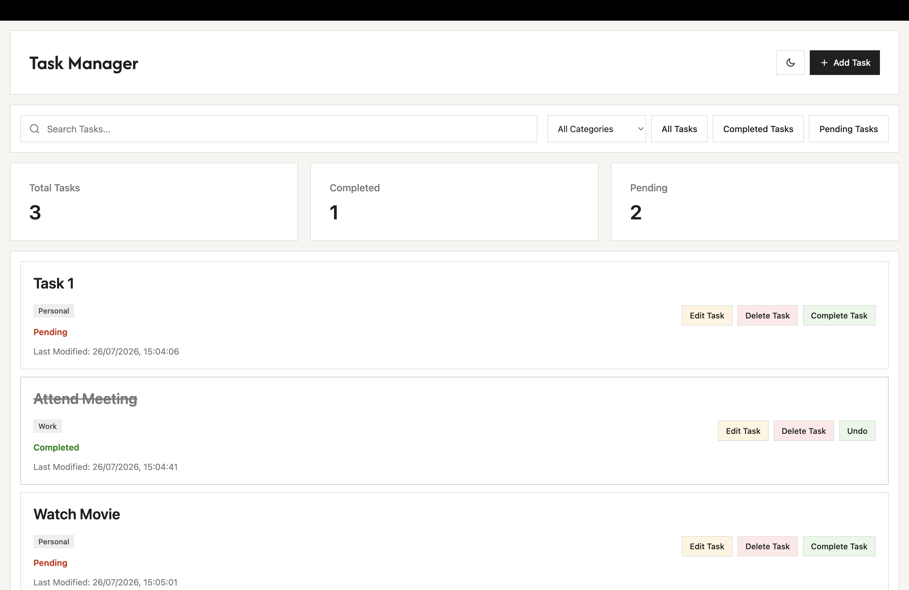
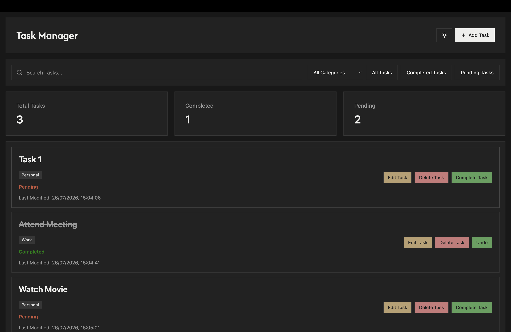
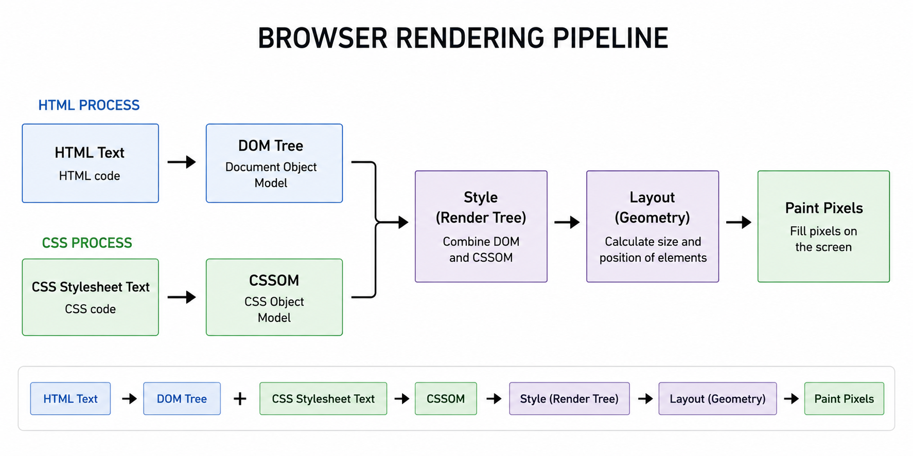

# Task Manager

## DOM Task Manager

<div align="center">
  
  
</div>

## 🚀 Live Demo

[](https://masumprajapati5.github.io/Task-Manager/)

---

## 1. Difference Between

```text
input.value
```
and

```text
input.getAttribute("value")
```

The main difference is that `input.value` gives the current value of the input, so it changes when the user types something.

On the other hand, `input.getAttribute("value")` reads the value that was originally set in the HTML attribute and does not automatically change with user input.

So basically:
```text
input.value                  -> current DOM value
input.getAttribute("value")  -> HTML attribute value
```

---

## 2. Event Propagation

Event propagation describes how an event travels through the DOM.

For example:

```html
<div id="grandparent">
    <div id="parent">
        <button id="child">Click Me</button>
    </div>
</div>
```

### Event Bubbling

In bubbling, the event starts from the target and then moves towards its parent elements.

```text
Child
  ↓
Parent
  ↓
Grandparent
```

Example:

```js
child.addEventListener("click", () => {
    console.log("Child");
});

parent.addEventListener("click", () => {
    console.log("Parent");
});

grandparent.addEventListener("click", () => {
    console.log("Grandparent");
});
```

When the child is clicked, the console output will be:

```text
Child
Parent
Grandparent
```

This project also uses bubbling for **event delegation**.

Instead of putting separate event listeners on every Edit, Delete and Complete button, one event listener is added to the task container.

```js
allTasks.addEventListener("click", (e) => {
    const card = e.target.closest(".task");

    if (!card) return;

    // Edit, Delete and Complete actions
});
```

This is useful because task cards are created dynamically.

### Event Capturing

Capturing works in the opposite direction.

The event travels from the outer element towards the target.

```text
Grandparent
    ↓
Parent
    ↓
Child
```

Capturing can be enabled by passing `true`:

```js
grandparent.addEventListener("click", () => {
    console.log("Grandparent");
}, true);

parent.addEventListener("click", () => {
    console.log("Parent");
}, true);

child.addEventListener("click", () => {
    console.log("Child");
}, true);
```

Output:

```text
Grandparent
Parent
Child
```

So:

```text
Capturing -> Parent to Target
Bubbling  -> Target to Parent
```

---

## 3. Browser Rendering Pipeline

<div align="center">
  
</div>

---

## 6. DOM Manipulation

Tasks in this project are generated dynamically using JavaScript.

For example:

```js
const card = document.createElement("div");

card.classList.add("task");

allTasks.append(card);
```

Each task also stores information using custom data attributes:

```js
card.dataset.id = x.id;
card.dataset.category = x.category;
card.dataset.status = x.status;
```

This results in something similar to:

```html
<div
    class="task"
    data-id="1"
    data-category="Work"
    data-status="Pending">
</div>
```

---

## 7. Features of Task Manager

The Task Manager currently includes:

- Add Task
- Edit Task
- Delete Task
- Complete / Undo Task
- Search Tasks
- Category Filter
- Completed Tasks Filter
- Pending Tasks Filter
- Total Task Counter
- Completed Task Counter
- Pending Task Counter
- Dark / Light Mode
- Local Storage
- Responsive Design
- Event Delegation

---

## Tech Stack

```text
HTML
CSS
JavaScript
```
